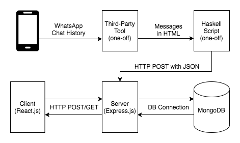

# chat-history-viewer
A more pleasant experience to view conversation history. 
Display messages extracted by a third-party tool.

## Features unique to this viewer
- Tagging/Bookmarking
  - Jump to your favorite points in time to relive special moments
  - Bookmark where you paused to continue next time
- Bulk loading
  - Load any number of messages in bulk with one click (instead of keep scrolling up)

## Other features (similar to the default viewer of messaging apps)
- Scroll upward to load older messages
- Search (including messages that have not been loaded)

## How it looks


**Left:** Messages. Scroll upward to load older messages.  
**1:** Load a specified number of older messages in bulk (instead of keep scrolling up).  
**2:** Text search. It can return messages that have not been loaded in the client. Double click on a search result to load and jump to the message.  
**3:** Add tag. Double click on a message on the left to select it for tagging. Then enter a tag name for that message.  
**4:** Tagged messages displayed under tag names. Double click on a message to load and jump to the message.

## About the system


1. Extract WhatsApp messages from phone using a third-party tool into an HTML file similar to ./haskell/sample_messages.html
2. Haskell script parses the HTML file and persists messages into MongoDB by POST-ing to the Express server. Attributes stored include direction (incoming/outgoing), type (text/img), timestamp, and actual message content (text or image encoded in base64)
3. Client communicates with server via a REST API, starting by requesting latest messages and tags

## How to run
1. Host a MongoDB at localhost:27017 (configured at ./express/server/server.js)
2. Start Express server
   ```
   cd ./express
   npm start
   ```
3. Compile and execute Haskell script by
   ```
   cd ../haskell
   ghc --make ./parse_html_and_post_to_server.hs
   ./parse_html_and_post_to_server
   ```
   This will populate MongoDB with the messages in haskell/sample_messages.html
4. Bundle and serve the React app
   ```
   cd ../react
   npm start
   ```
5. Visit localhost:8080 in a browser
